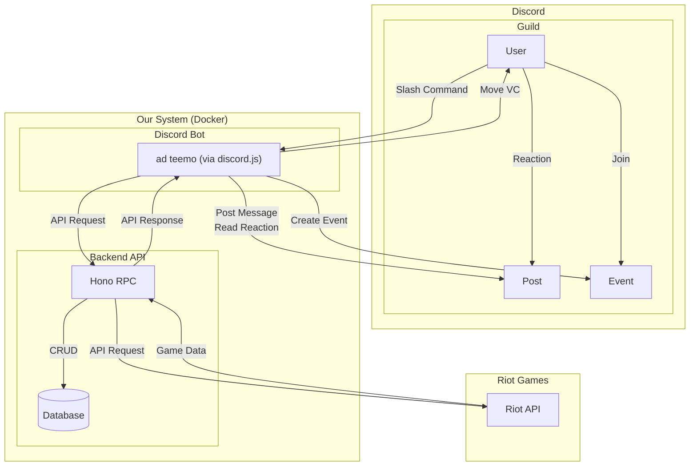

# LoLカスタムゲームサポートBot "ADTeemo" 仕様書

## 1. プロジェクト概要

本プロジェクトは、League of Legends (LoL) のカスタムゲーム開催を円滑にするためのDiscord Botを開発する。

参加者の募集からチーム分け、戦績管理までを自動化し、コミュニティ内でのイベント開催コストを削減することを目的とする。

本仕様書はADTeemoの機能要件および非機能要件の正規リファレンスである。現時点で未実装または最小構成の状態に留まる項目は、追跡のため `docs/TODO.md` に明記する。

## 2. システムアーキテクチャ

システムは、Discord BotとバックエンドAPIサーバーの2つのコンポーネントで構成される。

### 2.1. 技術スタック

| コンポーネント   | 技術                          | 備考                              |
| :--------------- | :---------------------------- | :-------------------------------- |
| **共通**         | TypeScript, Deno, Docker      | プロジェクト全体の基盤技術        |
| **Discord Bot**  | discord.js                    | Denoのnpm互換機能を利用           |
| **Backend API**  | Hono (RPC), Zod               | APIサーバーフレームワークと型検証 |
| **データ永続化** | SQLite                        | Cloudflare D1を想定。             |
| **開発手法**     | TDD (Test-Driven Development) | t_wada氏の提唱する手法に準拠      |

## 3. 機能要件

### 3.1. ユーザー・ロール管理

- **ロール連携**: Botは起動時、または特定のコマンド実行時に、`Top`, `JG`, `Mid`, `Bot`, `Sup`, `Custom`, `Red Team`, `Blue Team` のDiscordロールがサーバーに存在するか確認し、なければ自動で作成する。サーバーごとにロールのIDを保存しておく。
  - **Customロール**: カスタム戦への参加意欲があるユーザーを示すロール。新規イベントの案内や、参加者不足時の補充メンバーを募集する際のメンション対象として使用する。
- **Bot権限とIntent**: Botには `Manage Roles`, `Manage Events`, `Manage Channels`, `Move Members`, `Send Messages`, `Read Message History` など、上記機能を実現するために必要な最小限のDiscord権限を付与する。Gateway Intentは `Guilds`, `GuildMembers`, `GuildMessages`, `GuildMessageReactions`, `GuildVoiceStates` の有効化を必須とし、イベント・リアクション・VC状態を確実に取得する。
- **データ保存**: ユーザーのDiscord IDとRiot ID、メインレーン、後述する内部レートは、サーバー(Guild)IDと紐付けてバックエンドAPIを通じてデータベースに保存される。
  - **Riot ID登録**: `/set-riot-id <サモナー名>#<タグライン>` のようなコマンドによる自己申告制とする。将来的にはRiot Sign-On (RSO) を利用した認証への移行を検討する。
  - **メインレーン設定**: ユーザーはスラッシュコマンド (`/set-main-role` 等) を使用して、自身のメインレーン (Top, JG, Mid, Bot, Sup) を設定できる。

### 3.2. カスタムゲームイベント管理

- **イベント作成**: `/create-custom-game` のようなスラッシュコマンドで、Discordのスケジュールイベントを作成する。
- **募集チャンネル設定**: ユーザーは募集用のメッセージなどを投稿するチャンネルを設定できる。
- **参加者募集**: イベント作成と同時に、Botは募集用のメッセージを募集チャンネルに投稿する。 `Custom` ロールへのメンションを行う。メッセージにはロールごとの絵文字リアクションが付与される。
- **参加登録**: ユーザーは募集メッセージにリアクションすることで、そのゲームで希望するロールを表明し、参加登録を行う。複数ロールへのリアクション (複数ロールでの参加希望) を許可する。
- **VCチャンネル設定**: ユーザーはカスタム戦で使用するLobby, Red Team, Blue TeamそれぞれのVCチャンネルを設定できる。
- **イベントキャンセル**: `/cancel-custom-game` のようなコマンドで、カスタム戦の作成者が作成したイベントをキャンセルする。

### 3.3. チーム分けとゲーム開始

- **参加者確定**: イベント主催者が `/start-matching` のようなコマンドを実行すると、リアクションを元に参加者を確定する。該当のイベントを開始状態にする。
- **例外処理**:
  - **ロール不足/10人未満**: イベント開始数分前にロールの参加者が不足している場合、Botは不足ロールを通知する。その際、 `Custom` ロールを持ち、かつ過去に不足ロールでの参加経験があるユーザーにメンションを送り、参加を促す。
  - **11人以上**: 参加希望者が10人を超えた場合、Botは溢れているロールと人数を表示する。
  - **最終判断**: 上記いずれの場合も、最終的な参加者の決定や、ゲームの開始/中止の判断はイベント主催者がコマンドで行う。
- **チーム分けアルゴリズム**:
  1. **参加者確定**: 主催者によって10名の参加者が確定される。
  2. **組み合わせ探索**: 参加者10名を、各ロールが1名ずつ含まれる2つのチームに分ける全ての組み合わせを探索する。その際、以下の条件を考慮する。
     - **希望ロール優先**: ユーザーが希望したロールに配置されることを最優先とする。
     - **戦力均等化**: 各組み合わせについて、全プレイヤーの「内部レート」と「LoLランク情報」を総合的に評価したチーム戦力値を計算し、両チームの戦力値の差が最も小さくなる組み合わせを複数候補として選出する。
  3. **最終決定**: 選出された候補の中からランダムで1つの組み合わせを最終的なチーム分けとして決定する。これにより、同じ参加者でも毎回異なるチーム分けが期待できる。
  4. **例外通知**: 希望ロールを優先した結果、チーム間の戦力差が一定の閾値を超えてしまう場合でもマッチングは成立させる。
- **結果発表**: チーム分けの結果をメンション付きでチャンネルに投稿する。戦力差が大きい場合は、その旨の警告メッセージを併記する。主催者はその警告を元に、 `/rematch` コマンドで再マッチングを行うか、そのままゲームを続行するかを判断できる。
- **ゲーム開始**:
  - **VC移動**: 参加者を `Red Team`, `Blue Team` という名前のボイスチャンネルへ一括で移動させる。チャンネルが設定されていない場合は自動で作成する。

### 3.4. 戦績管理と内部レートシステム

- **ゲーム追跡**: チーム分け完了後、BotはRiot API (`active-games` エンドポイント) を定期的にポーリングし、参加者のゲーム開始を監視する。
- **ゲームID記録**: ゲームが開始されたことを検知したら、その`gameId`をバックエンドに保存する。
- **自動戦績取得**: ゲーム終了後、保存した `gameId` を使用してRiot APIから試合結果 (勝敗、KDA等) を自動で取得し、データベースに記録する。
- **内部レート算出**:
  - **初期レート**: ユーザーのLoLランク情報を元に初期レートを決定する。
    - ランク情報を持たないユーザーについては、Riot API経由で直近のノーマルゲーム (サモナーズリフト) の戦績を複数取得し、マッチングした対面プレイヤーのランク情報から平均値を算出し、暫定的な初期レートとして設定する。この処理は、ユーザーが `/set-riot-id` で初回登録する際に一度だけ実行される。
  - **レート更新**: カスタムゲームの勝敗結果に加え、KDA, CS, 獲得ゴールド, チームメイト/対戦相手のレート, レーン対面の勝敗など、多角的な要素を考慮した独自の計算式で内部レートを更新する。
  - レートの変動幅 (Kファクター) は設定可能とする。

### 3.5. その他のコマンド

- **戦績確認**: `/my-stats` のようなコマンドで、ユーザーが自身の内部レート、通算成績（勝敗、平均KDAなど）を確認できる機能。
- **再マッチング**: `/rematch` のようなコマンドで、現在の参加者のまま再度チーム分けを実行する機能。何らかの理由でチームを再編成したい場合に利用する。
- **次の試合**: `/next-game` のようなコマンドで、カスタムゲーム終了後に連続して次の試合を開始する機能。以下のオプションを提供する。
  - `サイド交代`: 現在のチーム編成のまま、RedチームとBlueチームを入れ替えて再戦する。
  - `チーム再編成`: 現在の参加者のまま、チーム分けを再度実行する (`/rematch` と同等)。
  - `メンバー変更`: 参加者を再募集するフローに戻る。

## 4. 非機能要件

- **設定管理**: Discord BotトークンやRiot APIキーなどの機密情報は、環境変数または設定ファイルから読み込む形式とし、コードに直接記述しない。
- **レート制限対策**: Discord APIおよびRiot APIへのリクエストは公式ガイドラインのレート制限を順守する。リクエストはキューイングや指数バックオフで間隔を制御し、レスポンスヘッダーの残余回数を監視して速やかに待機・再試行する。可能な箇所ではキャッシュや差分更新を活用し、不要なポーリングを避ける。
- **デプロイ**: 全てのコンポーネントをDockerコンテナとして実行可能にする。`docker-compose.yml` を提供し、容易に起動できるようにする。
- **スコープ**: Botは複数のDiscordサーバーへの導入を想定する。各サーバーのデータ（ユーザー情報、戦績、ロール設定など）は、サーバーごとに独立して管理される。これを実現するため、データベースの各テーブルはサーバーを識別するID (`guild_id`) を保持する設計とする。
