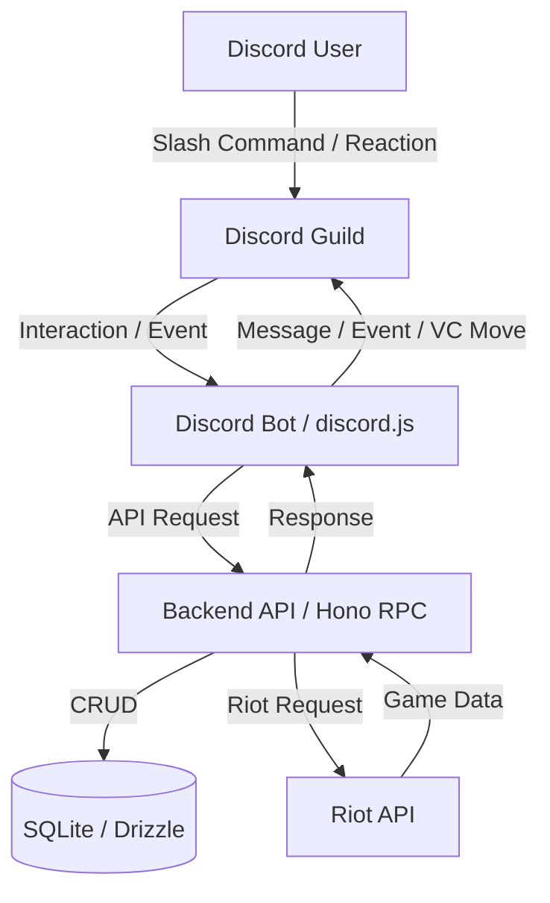

# ADTeemo 仕様書

## 1. 位置づけ

ADTeemoはLeague of Legendsのカスタムゲーム運営を支援するDiscord Botである。参加募集、ロール希望の収集、チーム分け、VC移動、戦績記録、LoL試合監視をDiscord上から扱えるようにする。

この文書はADTeemoの仕様リファレンスである。詳細な実装タスクと優先順位はGitHub Issuesを正とし、[TASKS.md](./TASKS.md) はその要約Roadmapとして扱う。

## 2. システム構成

ADTeemoはDiscord BotとBackend APIの2コンポーネントで構成する。

```mermaid
graph TD
    User[Discord User]
    Discord[Discord Guild]
    Bot[Discord Bot / discord.js]
    API[Backend API / Hono RPC]
    DB[(SQLite / Drizzle)]
    Riot[Riot API]

    User -- Slash Command / Reaction --> Discord
    Discord -- Interaction / Event --> Bot
    Bot -- API Request --> API
    API -- CRUD --> DB
    API -- Riot Request --> Riot
    Riot -- Game Data --> API
    API -- Response --> Bot
    Bot -- Message / Event / VC Move --> Discord
```

| Area        | Stack                                          |
| ----------- | ---------------------------------------------- |
| Runtime     | Deno 2.5+, TypeScript                          |
| Backend API | Hono RPC, Zod                                  |
| Database    | SQLite, Drizzle ORM                            |
| Discord Bot | discord.js                                     |
| Messages    | `messages` workspaceの言語・テーマ別メッセージ |
| Container   | Docker, Docker Compose                         |

## 3. データ所有権

ADTeemoは複数Discordギルドへの導入を想定する。プレイヤー本人に紐づく情報はグローバル、Discord運用に依存する情報はギルド別に保持する。

| データ                                         | 所有範囲   | 現行方針                                                                                 |
| ---------------------------------------------- | ---------- | ---------------------------------------------------------------------------------------- |
| Discordユーザー                                | グローバル | `users.discord_id` を主キーとして保持する。                                              |
| Riotアカウント                                 | グローバル | `riot_accounts` にPUUID、Riot ID、platform、regionを保存する。                           |
| メインロール                                   | ギルド別   | `user_guild_profiles` で `user_id + guild_id` に紐づける。                               |
| カスタムゲームイベント                         | ギルド別   | `custom_game_events` に `guild_id`、作成者、Discord event ID、募集message IDを保存する。 |
| 試合監視設定                                   | ギルド別   | `match_watchers` に `guild_id + target_discord_id` 単位で保存する。                      |
| 試合結果、内部レート、通算戦績                 | グローバル | プレイヤー評価として共有する想定。Match-v5結果のDB保存と内部レート更新は未実装。         |
| 募集チャンネル、VC、ロールID、イベント操作権限 | ギルド別   | ギルド設定として永続化する想定。専用設定テーブル/APIは未実装。                           |

## 4. 実装

### 4.1. ユーザー・ロール管理

- `/set-riot-id` はRiot IDをRiot Account-v1で解決し、PUUID、gameName、tagLine、platform、regionを `riot_accounts` に保存する。
- `/link-riot-account` はRiot Sign On連携用URLを返す。利用には `RSO_CLIENT_ID`、`RSO_CLIENT_SECRET`、`RSO_REDIRECT_URI` が必要である。
- `/set-main-role` はユーザーのメインロールをギルド別に保存する。
- Botはギルド参加時または `/setup-roles` 実行時に `Top`, `JG`, `Mid`, `Bot`, `Sup`, `Custom` ロールを検出し、不足分を作成する。
- 自動作成・検出した DiscordロールIDの永続化は未実装である。

### 4.2. カスタムゲームイベント

- `/create-custom-game` はDiscordスケジュールイベントを作成し、実行チャンネルに募集メッセージを投稿する。
- 募集メッセージにはロール別リアクションを付与し、参加希望ロールをリアクションで収集する。
- `/cancel-custom-game` は実行者が作成した有効なカスタムゲームイベントを選択してキャンセルする。
- 募集チャンネル、Lobby/Red/Blue VC、ロールIDなどのギルド固有設定APIは未実装である。

### 4.3. チーム分け

- `/split-teams` は募集リアクションを集計し、ロールごとに2人ずつ、合計10人の参加者を前提に2チームへ分ける。
- チーム分け後、参加者を `Red Team` / `Blue Team` という名前のVCへ移動する。
- 現状はコマンド実行者が作成した今日開始のイベントを対象とし、対象イベントを明示選択するUIは未実装である。
- 内部レートやランクを使った高度な戦力均等化は未実装である。

### 4.4. カスタムゲーム支援の将来仕様 (WIP)

- 募集チャンネル、Lobby / Red Team / Blue Team VC、ロールIDなどのギルド固有設定を永続化する。
- 作成済みイベントの中から対象イベントを明示的に選択できるようにする。
- `/start-matching` または同等の開始操作で、参加者不足、ロール不足、11人以上の状態を通知する。
- 主催者が参加者を確定し、イベントを開始状態へ遷移できるようにする。
- 参加者10名を、各ロールが1名ずつ含まれる2チームへ分ける。
- 将来的には希望ロール優先、内部レート、LoLランク情報を使った戦力均等化を行う。
- 戦力差が大きい場合は警告を表示し、主催者が再マッチングまたは続行を選べるようにする。
- `/rematch` で現在の参加者のまま再チーム分けできるようにする。
- `/next-game` でサイド交代、チーム再編成、メンバー変更の導線を提供する。
- Message Componentsを使い、開始、チーム分け、キャンセル、再マッチング、次ゲームを段階的に操作できるようにする。
- `Red Team` / `Blue Team` VCが無い場合の自動作成、または管理者確認フローを提供する。

### 4.5. 戦績記録

- `/record-match winner:<BLUE|RED>` は現在の参加者についてKDA / CS / Goldを対話形式で入力し、戦績を記録する導線である。
- Match-v5で取得した試合結果を既存 `matches` / `match_participants` に保存し、内部レート更新へ接続する処理は未実装である。

### 4.6. 試合監視

- `/watch-match @member` はRiot ID連携済みメンバーをギルド単位で手動監視対象にする。
- `/unwatch-match @member` は手動監視を停止する。
- `/watch-list` は実行ギルド内の有効な監視対象一覧を表示する。
- BotはRiot Spectator-v5で試合開始・試合中概要・終了を検知し、Riot Match-v5で終了後の勝敗、KDA、CS、Gold、CS/min、キル関与率を通知する。
- 同一 `guildId + channelId + Riot platform + gameId` で複数監視対象が同じ試合にいる場合、試合中通知は1投稿に統合する。Riot platformが異なる場合は numeric `gameId` が同じでも別試合として扱う。
- 結果通知は監視対象ごとの個別通知である。共有された試合中投稿IDを結果通知へ使う場合も、上書き防止のため同一active group内で1回だけ再利用する。
- Riot API呼び出しは共有キューで制御し、429とrate limit headersを後続呼び出しへ反映する。

## 5. 将来構想と追跡中のIssue

### 5.1. 試合結果表示の拡張 (#28)

PR #39で `CS/min` と `キル関与率` は実装済みである。残件は #28 を親Issueとして、OP.GG試合詳細リンクと詳細データ取得は #53、LP deltaと現在ランク表示は #54、Embed表示項目とロール別優先順位は #55、OP.GG未公開Server Action依存の運用リスクは #56 で追跡する。OP.GGプロフィールリンクは表示対象外とし、詳細リンクが解決できる場合だけ表示する。

### 5.2. デフォルト監視とopt-out (#34)

今後はRiot ID連携済みユーザーを既定で監視対象にし、ユーザーがopt-outできる設計を検討する。新方針では、既存の手動 `/watch-match` / `/unwatch-match` は廃止候補である。詳細は [docs/default-watch-opt-out.md](./docs/default-watch-opt-out.md) を参照する。

### 5.3. Discord connected accounts調査 (#35)

DiscordのLeague of Legends / Riot Games connected accountsからRiot情報を取得できるか調査中である。Bot tokenだけでは任意GuildMemberのconnected accountsを読めず、ユーザー同意付きDiscord OAuth2 `identify connections`とredirect URI運用が必要である。詳細は [docs/discord-lol-connections.md](./docs/discord-lol-connections.md) を参照する。

### 5.4. サブアカウント対応 (#48)

Discordユーザーに複数Riotアカウントを紐づけ、メインアカウントとサブアカウントを区別する機能を検討する。既存 `riot_accounts` は現在1Discordユーザー1Riotアカウントの構造である。

### 5.5. Podman移行 (#49)

Docker / Docker Compose前提の開発・運用をPodman / Podman Composeへ移行または併用できるか検討する。

### 5.6. 公式パッチノート通知 (#50)

公式パッチノート更新を特定チャンネルへ通知する機能を検討する。将来的には他ニュースの通知にも拡張できる設計が必要である。

### 5.7. カスタムゲーム運営フロー (#51)

カスタムゲーム支援機能は、現状の最小実装からイベント中心フローへ拡張する。対象イベント選択、参加者確定、参加者不足/過多の通知、Message Componentsによる操作、再マッチング、次ゲーム、ギルド設定永続化を追跡する。

## 6. 非機能要件

- 機密情報は環境変数から読み込み、コードやGit管理ファイルに保存しない。
- Bot/APIの表示文言は言語・テーマ別メッセージカタログで管理する。テーマ別カタログにキーがない場合は既定テーマへfallbackする。
- メッセージJSONの重複キー・不足キーは `deno task check:messages` で検出する。
- APIレスポンスの成否判定はHTTPステータスを唯一のソースとし、HTTP APIレスポンスボディに `success` を含めない。
- エラー時は原則 `{ "error": "message" }`、必要時のみ `{ "code", "error", "details" }` に拡張する。
- Riot API / Discord APIのrate limitを尊重し、再試行・backoff・共有キュー・キャッシュを活用する。
- 通常の `deno task test:all` は外部サービスへ接続しない安定したテストとして維持する。実Riot API疎通は `deno task test:riot-live` で明示的に実行する。
