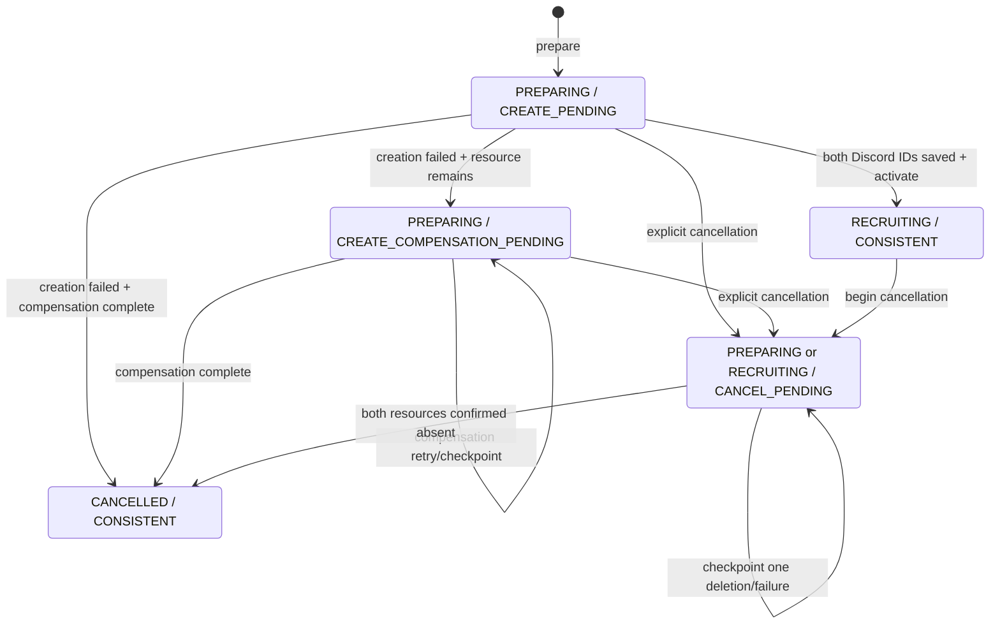

# カスタムゲームイベントの整合性と復旧

- Type: integration
- Status: current
- Summary: Discord外部副作用とイベント永続化の整合性・復旧。
- Read when: イベント作成・取消・復旧・migrationの変更時。
- Related: [#114](https://github.com/akgm3i/ADTeemo/issues/114)
- Code: [event repository](../api/src/db/repositories/events.ts), [saga](../bot/src/features/custom_game_event_saga.ts)
- Tests: [saga tests](../bot/src/features/custom_game_event_saga.test.ts), [repository tests](../api/src/db/repositories.integration.test.ts)
- Reviewed: 2026-09-25
- Verified: local code review, 2026-09-25

## 目的

カスタムゲームイベントの作成・取消は、SQLiteのtransactionだけではDiscordスケジュールイベントと募集メッセージまで同時にcommitできない。この文書は、Backend APIを状態の正本、Discordを外部side effectとして扱うsagaの不変条件と運用手順を定める。

## 所有範囲

イベントを操作するAPIは、常に次の組を同時に照合する。

- `eventId`
- `guildId`
- `recruitmentChannelId`

IDだけが一致しても、別ギルドまたは別募集チャンネルからは同じイベントとして扱わない。作成者による一覧も `guildId + recruitmentChannelId + creatorId` で絞り込み、`CANCELLED` を除外する。

`discordScheduledEventId` と `recruitmentMessageId` は、それぞれ1イベントだけが所有する外部resource IDである。DBのunique制約で別イベントからの共有参照を拒否し、取消が別イベントのresourceを削除することを防ぐ。

`voiceChannelId` は作成内容として保存するが、イベント操作のscope keyではない。途中から別の値へ差し替えず、変更が必要なら既存イベントを取り消して新しい `operationKey` で作り直す。

## 状態モデル

`phase` は利用者から見たイベントの段階、`syncState` はDBとDiscordの同期作業を表す。片方だけで処理可否を判断しない。

| `phase`      | 意味                                                 |
| ------------ | ---------------------------------------------------- |
| `PREPARING`  | Discord resourceの作成中で、募集対象にはまだ出さない |
| `RECRUITING` | 作成完了済みで、参加募集・チーム確定・戦績記録が可能 |
| `CANCELLED`  | 取消完了済みのtombstone。物理削除しない              |

| `syncState`                   | 意味                                               |
| ----------------------------- | -------------------------------------------------- |
| `CREATE_PENDING`              | Discord resourceを作成し、そのIDを保存している途中 |
| `CONSISTENT`                  | 現在追跡中の外部side effectがない                  |
| `CREATE_COMPENSATION_PENDING` | 作成失敗後のDiscord resource削除が未完了           |
| `CANCEL_PENDING`              | 明示取消のDiscord resource削除が未完了             |

新規処理で使用する有効な組み合わせは次のとおりである。

| `phase`      | `syncState`                   | 操作                                             |
| ------------ | ----------------------------- | ------------------------------------------------ |
| `PREPARING`  | `CREATE_PENDING`              | 作成を再開するか、失敗時に補償する               |
| `PREPARING`  | `CREATE_COMPENSATION_PENDING` | 残ったDiscord resourceの削除を再試行する         |
| `PREPARING`  | `CANCEL_PENDING`              | 作成途中から明示取消し、残ったresourceを削除する |
| `RECRUITING` | `CONSISTENT`                  | 通常の募集・参加者確定・戦績記録を行う           |
| `RECRUITING` | `CANCEL_PENDING`              | 明示取消の削除を再試行する                       |
| `CANCELLED`  | `CONSISTENT`                  | 完了済みtombstoneとして保持する                  |



補助列の意味は次のとおりである。

- `revision` は更新ごとに増えるrepository内部の楽観的排他制御値である。同じtransaction中に読んだrevisionから別処理が先に更新した場合は `409 CONFLICT` となる。API requestがrevisionを指定する契約ではない。
- `discordEventDeleted` と `recruitmentMessageDeleted` は、対応するresourceの不存在を確認済みであることを表す。削除成功、Discordのnot found、または対応する作成stepを実行していないと確定できた場合だけ `true` にし、一度 `true` になった値は戻さない。検索成功0件だけでは、Discord側の反映遅延と区別できないため不存在確認済みにしない。
- resource IDがnullであることだけでは、不存在や補償完了を意味しない。IDがnullでも対応する削除flagがfalseなら、作成応答を失った可能性を残してpendingとする。
- `lastFailureCode` は `A-Z`、数字、underscoreだけからなる安定した分類コードを保存する。Discordの本文、token、user ID、opaqueな例外文字列を保存しない。

## 作成saga

開始日時はSQLiteの保存精度に合わせた秒精度で比較する。同じ秒を表す入力のミリ秒成分だけの違いは、prepare再送の入力競合とは扱わない。

Botは次の順序を守る。

1. 1回のDiscord command invocationに対して安定した1〜25文字の `operationKey` を決め、イベント名、guild、作成者、募集チャンネル、VC、開始日時とともにAPIへprepareする。上限はDiscord message nonceの契約に合わせる。
2. APIがDBへ `PREPARING / CREATE_PENDING` をcommitする。初回は `201`、同一 `operationKey`・同一入力の再送は既存行を `200` で返す。同じkeyを別入力へ使うと `409` になる。
3. 保存済み `discordScheduledEventId` がなければ、descriptionに `ADTeemo operation:<operationKey>` markerを持つDiscordスケジュールイベントをguildから検索する。一意に見つかれば再利用する。今回prepareで新規作成した行、または現在のprocessで外部作成未着手と確定できる再試行だけは、見つからなければ同じmarkerを含めて作る。既存 `CREATE_PENDING` の再開で検索成功0件なら、反映遅延と未作成を区別できないため新規作成せずpendingに残す。IDを得た直後、次のDiscord操作より先にAPIへPATCHする。
4. 保存済み `recruitmentMessageId` がなければ、イベント作成時刻以降の募集チャンネルからBot自身が投稿した同じ `ADTeemo operation:<operationKey>` embed footerのメッセージを検索する。一意に見つかれば再利用する。今回の処理で投稿未着手と確定できる場合だけ、見つからなければ `nonce: operationKey` と `enforceNonce: true`、永続operation markerを持つembed footerを指定して投稿する。既存 `CREATE_PENDING` の再開で検索成功0件なら新規投稿せずpendingに残す。IDを得た直後、リアクション追加より先にAPIへPATCHする。
5. 募集メッセージへロール別リアクションを追加する。
6. 両方のIDがDBにあることを前提にactivateし、`RECRUITING / CONSISTENT` へ遷移する。

同じcommand handler内のbounded retryでは、同じ `operationKey` でprepareから読み直し、返された状態と保存済みIDを正本に未完了stepだけを続ける。progress APIの結果が不明でも、直前のDiscord応答から判明しているIDをprocess内のresume contextに保持し、DBが未保存なら新規resourceを作らず同じIDをprogressへ再送する。保存済みIDがあるresourceを再作成してはならない。作成progressへ同じIDを再送する操作と、完了済みactivateの再送はDiscord side effectと最終状態について冪等である。保存済みIDと異なるIDを送ると `409` になるため、自動で上書きしない。

`CREATE_PENDING` なら作成を続け、`CREATE_COMPENSATION_PENDING` なら作成を再開せず補償だけを続ける。`RECRUITING / CONSISTENT` なら完了済みとして成功を返す。`CANCEL_PENDING` または `CANCELLED` を新しい作成として再利用せず、利用者が改めて作成する場合は新しい `operationKey` を使う。

現在の `/create-custom-game` は `interaction.id` を `operationKey` にするため、利用者がslash commandをもう一度実行すると別keyの新規作成になる。handler内の再試行を使い切って未完了状態が残った後、同じkeyで作成を再開するcommandやbackground workerは未実装である。現在のguild・募集チャンネル・作成者から `/cancel-custom-game` で対象を選び、finderと取消sagaでresourceをreconciliationしてから、新しいcommandで作り直す。取消からも復旧できない行は運用者判断へ送る。

### 作成失敗時の補償

Discord作成helperが回復できないまま失敗した場合、リアクション追加に失敗した場合、またはAPIがcommitしていないことを4xx responseで確定できる場合は、次の順で補償する。

1. Discord resourceを削除する前に、既知の両ID、現在の削除flag、安定した `failureCode` をcreation-failure APIへ送り、DBを `CREATE_COMPENSATION_PENDING` にする。このclaimが失敗した場合は同じ `operationKey` でprepareを再読し、`RECRUITING / CONSISTENT` なら並行処理が作成を完了したものとしてresourceを削除しない。commit結果を確認できなければ削除を始めない。
2. 募集メッセージIDがなければBot自身のembed footerのoperation markerで検索する。1件ならIDを回収し、creation-failure APIへIDをcheckpointして保存を確認してから削除する。ID保存が失敗した場合は削除しない。検索成功0件だけでは不存在確認済みにせず、対応する作成stepを実行していないと現在の処理から確定できる場合を除いて削除flagをfalseに保つ。
3. DiscordスケジュールイベントIDがなければoperation markerで検索する。1件ならIDを回収し、creation-failure APIへIDと現在の補償進捗をcheckpointして保存を確認してから削除する。ID保存が失敗した場合は削除しない。検索成功0件なら削除flagをfalseに保つ。
4. 各削除結果をcreation-failure APIへ再送し、補償進捗を確定する。

両resourceの不存在を確認して削除flagがともにtrueになれば `CANCELLED / CONSISTENT` になる。不存在を確認できないresourceが1つでもあれば `PREPARING / CREATE_COMPENSATION_PENDING` に残し、IDが分かるものは同じIDを使って削除を再試行する。削除APIのnot foundは「すでに削除済み」として扱える。

検索自体が失敗した、または同じ識別子のresourceが複数あり一意に選べない場合は、対応する削除flagをfalseのまま送る。IDがnullという理由だけで補償完了にしない。

### API mutationの結果が不明な場合

prepareの応答を確認できない場合はDiscord side effectを始めず、同じ `operationKey` と同じ入力でprepareを再送する。

creation progressまたはactivateについて、次の失敗はDB commitの有無が不明である。

- network errorまたはtimeout
- 5xx response
- 2xx responseだがbodyをAPI契約としてparseできない、またはactivate後のstateが `RECRUITING / CONSISTENT` ではない

この場合は、その場でDiscord resourceを補償削除せず、creation-failure APIも呼ばない。activateがcommit済みなのに応答だけ失われた場合、Discordを削除するとDBだけが `RECRUITING / CONSISTENT` の逆不整合になるためである。

同じ `operationKey` でprepareを再送してDB状態を読み直し、次のように再開する。

- `RECRUITING / CONSISTENT` なら完了済みとして終了する。
- resource IDがDBへ保存済みなら、そのIDを再利用して次の未完了stepへ進む。
- DBにIDがなく、直前のDiscord応答からIDが分かるなら、同じIDをcreation progressへ再送する。
- process restartなどでIDも失った場合は、operation markerからresourceを回収して同じIDを保存する。

APIが有効な4xx responseを返し、対象mutationがcommitされていないと確定できた場合だけ、creation-failureで補償状態を先にclaimしてから既知resourceを逆順補償する。失敗分類ができない場合やclaim結果が不明な場合はcommit不明側へ倒し、外部resourceを消さない。

## 取消saga

取消はDiscordを先に消さず、必ずDBを `CANCEL_PENDING` にしてから始める。

1. 現在のguildと募集チャンネルをscopeにbegin cancellationを呼ぶ。
2. `discordEventDeleted` がfalseなら、保存済みID、またはoperation markerでDiscordスケジュールイベントを一意に回収する。検索で回収した場合は、削除より先にその `discordScheduledEventId` をcancellation progressへPATCHする。保存済みIDを削除し、削除成功またはnot foundの直後に `discordEventDeleted: true` をPATCHする。検索成功0件ではflagを更新せず `CANCEL_PENDING` を維持する。
3. `recruitmentMessageDeleted` がfalseなら、保存済みID、またはembed footerのoperation markerで募集メッセージを一意に回収する。検索で回収した場合は、削除より先にその `recruitmentMessageId` をcancellation progressへPATCHする。保存済みIDを削除し、削除成功またはnot foundの直後に `recruitmentMessageDeleted: true` をPATCHする。検索成功0件ではflagを更新せず `CANCEL_PENDING` を維持する。
4. 両resourceの不存在を確認済みとAPIが判定すると `CANCELLED / CONSISTENT` になる。

途中失敗では、成功済みの削除flagと安定した `failureCode` を保存して `CANCEL_PENDING` を維持する。再試行時は最新イベントを読み、falseのflagに対応するresourceだけを削除する。完了済みbegin、削除flagの再送、完了済み取消の再送はいずれもDiscord side effectと最終状態について冪等である。

`custom_game_events` の行は取消後も監査と冪等性のため残す。Discord resourceを消しただけでDB行をDELETEしてはならない。

## 不明な結果と手動復旧

APIのprogress更新がtimeoutした場合は、前述のとおり同じ `operationKey` でDB状態を再読し、未保存なら同じresource IDを同じscopeへ再送する。同一IDの再送は保存済みresourceとの対応と最終状態を変えないため、結果を推測して別resourceを作ったり、Discord resourceを先に削除したりしない。

Discordスケジュールイベントの作成応答を受け取れずIDが不明な場合、helperは `operationKey` markerでguild内イベントを再検索する。一意に見つかれば再利用してIDをcheckpointする。helperが最終的に失敗して補償へ移った場合も検索し、1件なら回収して削除する。検索成功0件、同じmarkerが複数件ある、または検索自体が失敗した場合は削除flagをfalseにして補償をpendingへ残す。

募集メッセージの投稿結果が不明でIDも保存されていない場合も、同じoperation markerとBot自身の投稿者IDで検索する。作成helper内では一意に見つかれば再利用し、見つからなければ同じnonceと `enforceNonce: true` で再送する。補償へ移った場合は、1件なら回収して削除する。検索成功0件、同じoperation markerが複数件ある、または検索自体が失敗した場合は自動選択せず、削除flagをfalseに保つ。

Discordの検索結果が作成直後のresourceをまだ含まない、または旧実装の投稿に永続markerがない場合は、検索成功0件のままpendingへ残る。nonceの重複防止期間が過ぎた遅延再開では、検索で見逃した募集メッセージを重複投稿する可能性があるため、異常終了後はguild内イベントと募集チャンネルを目視確認し、orphanまたは重複を見つけたら追加作成せず手動reconciliationへ送る。

Bot process内では同じAPI clientを使うsaga同士で `operationKey` ごとの作成を共有し、判明した `eventId` の作成完了まで取消開始を待つ。別processから同じ作成が競合した場合は、creation progressの409後にDBを再読し、DB保存IDと異なる今回作成分だけを削除する。DB保存IDは削除しない。

作成側が `CANCEL_PENDING` を再読した時点で今回作成分のIDがDBに未保存なら、取消finderと同様にcancellation progressへtarget IDを保存し、保存を確認してから削除する。target保存が失敗した場合は削除せず、`CANCEL_PENDING` の再試行対象として残す。DBに別処理のwinner IDが保存済みの場合、loser IDで上書きしない。

この排他はprocess-localであり、永続的な外部effect claimではない。標準のDocker Compose構成はBot service 1 instanceを前提とし、Botを複数instanceへscaleしない。別process間でloser resourceの即時削除まで失敗すると、そのloser IDはDBの所有IDとして保存できないため自動再試行先が残らない。該当ログの `operationKey` と今回IDを使い、手動reconciliationへ送る。複数Bot instanceを許可する前に、外部effect claimをDBへ永続化する設計が必要である。

1. `operationKey` とcorrelation IDを使って対象DB行とログを特定する。
2. Discordのguild内イベント、募集チャンネル、監査情報をイベント名・開始日時・作成時刻で確認する。
3. resourceを一意に特定できたら、現在stateに対応するAPIだけを使う。`CREATE_PENDING` ではIDをcreation progressへ保存し、`CREATE_COMPENSATION_PENDING` ではresourceを削除してIDと削除結果をcreation-failureへ送る。`CANCEL_PENDING` では、回収したIDをcancellation progressへ先に保存してからresourceを削除し、削除flagを送る。
4. 一意に特定できなければ現在のpending状態を維持し、重複作成せず運用者判断へ送る。

Discord削除のtimeoutも、まず同じIDの取得または削除を再試行する。not foundを確認できた時点で削除flagをtrueにする。

`CREATE_COMPENSATION_PENDING` または `CANCEL_PENDING` で、削除flagがfalseかつ対応IDがnullなら、削除対象を特定できておらず不存在も未確認である。IDがnullという理由だけでflagをtrueにせず、operation marker、募集チャンネル、監査情報からresourceをreconciliationする。それでも特定できない場合はpendingのまま運用者判断へ送る。

## 旧イベント行の移行とreconciliation

整合性列を追加するmigrationは、旧イベント行を削除しない。旧値を保持し、次の初期値を設定する。

- `phase = RECRUITING`
- `sync_state = CONSISTENT`
- `revision = 0`
- 両削除flagはfalse
- `operation_key`、`recruitment_channel_id`、`voice_channel_id`、`last_failure_code` はnull

旧行の `CONSISTENT` は「旧処理に追跡中sagaがなかった」という移行値であり、Discord resourceの実在や新しいscope情報を確認済みという意味ではない。募集チャンネルがnullなので、新しいscope付きAPIからは一致せず、reconciliation完了まで隔離される。

移行後、次のqueryで対象を棚卸しする。

```sql
SELECT
  id,
  guild_id,
  creator_id,
  phase,
  sync_state,
  discord_scheduled_event_id,
  recruitment_message_id,
  scheduled_start_at
FROM custom_game_events
WHERE phase <> 'CANCELLED'
  AND (
    operation_key IS NULL
    OR recruitment_channel_id IS NULL
    OR voice_channel_id IS NULL
  )
ORDER BY id;
```

各行を1件ずつ次のいずれかへ分類する。

- 継続: Discordスケジュールイベントと募集メッセージを実際に確認し、正しい募集チャンネルとVCを補完する。`operation_key` には他行と重複しない `legacy-event:<id>` のような値を設定する。
- 廃止: 既知のDiscord resourceが存在しない、または削除済みであることを確認してから、削除flagを正しく設定し `CANCELLED / CONSISTENT` にする。行はtombstoneとして残す。
- 不明: guild、channel、resourceの対応を一意に確認できない。値や削除flagを推測で埋めず、scopeなしの隔離行として保持する。

手動UPDATEはBot/APIを停止し、対象DBを確認してbackupした後、IDを明示したtransaction内で行う。更新後は同じSELECT、`PRAGMA foreign_key_check`、Discord上のresourceを再確認してから再起動する。旧行を一括削除したり、null channelを現在の実行チャンネルで一律補完したりしない。

戦績列を含むmigration全体の事前確認、適用順序、rollback条件は[カスタム戦績の整合性と移行](./record-match-consistency.md)を参照する。

再取得時にnonceは失われるため、履歴復旧はnonceへ依存しない。[discord.js 14.22.1の公式Message仕様](https://discord.js.org/docs/packages/discord.js/14.22.1/Message:Class)。markerを持たない旧募集でmessage IDを失った場合は、自動復旧できたと判断せず手動照合へ送る。
