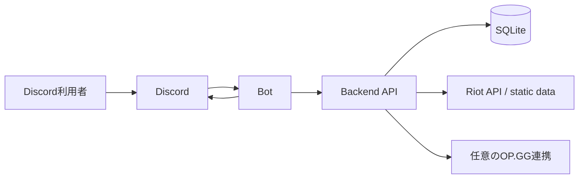

# 構成とデータ所有境界

- Type: integration
- Status: current
- Summary: Bot/API/DBの責務と変更時に読む正本。
- Read when: workspace境界、DBモデル、外部API取得を変更するとき。
- Related: [#69](https://github.com/akgm3i/ADTeemo/issues/69), [#112](https://github.com/akgm3i/ADTeemo/issues/112), [#113](https://github.com/akgm3i/ADTeemo/issues/113), [#114](https://github.com/akgm3i/ADTeemo/issues/114)
- Code: [API app](../../api/src/app.ts), [Bot main](../../bot/src/main.ts), [schema](../../api/src/db/schema.ts)
- Tests: [Bot boundary tests](../../bot/check-runtime-boundary.test.ts), [repository tests](../../api/src/db/repositories.integration.test.ts)
- Reviewed: 2026-09-25
- Verified: local code review, 2026-09-25

## 構成

Botはinteraction解釈・表示・Discord操作を担い、Riot API、静的データ、OP.GG、DB操作はBackend APIへ集約する。各workspaceの依存・実行taskはdeno.json、実行環境・Docker・設定は[CONTRIBUTING](../../CONTRIBUTING.md)を参照する。

## データ所有境界

プレイヤー本人のDiscord identity、Riot account、戦績はグローバルに扱う。メインロールはuserとguildの組、募集イベントとwatcherはguild単位で扱う。戦績は開催元eventとgame番号を参照し、記録時のPUUID snapshotを保持する。内部レートを採用する場合も全ギルド共有のプレイヤー評価という境界を維持するが、算出・集計は別の採用判断である。

Discord側resource ID、募集channel、使用VC、saga状態はeventの所有情報である。guild設定とrole IDはguild別、Riot accountはPUUID単位でDiscord所有者とメイン指定を保持する。監視は全登録account、カスタムゲームはメイン1件を使う。[ADR 0006](../adr/0006-account-monitoring-policy.md)とschemaを正とし、Proposalの候補tableを現行モデルとみなさない。

## 不変条件と入口

- 認証と外部到達性: [ADR 0001](../adr/0001-bot-service-authentication.md)。Bot credentialを他サービスの秘密値と共有しない。
- ログ: [ADR 0002](../adr/0002-structured-logging-trust-boundary.md)。stdout構造化ログを正本にし、opaqueなError本文や個人識別子を保存しない。
- HTTPエラー: [APIエラー契約](../api-error-contract.md)。成否はHTTP statusで判定し、HTTP bodyにsuccessを持たせない。
- 外部副作用とDB: [イベント整合性](../custom-game-event-consistency.md)、[戦績整合性](../record-match-consistency.md)。scope、冪等性、transactionと復旧をそれぞれの境界で守る。
- 監視通知: [表示ADR](../adr/0003-match-display-priorities.md)、[ランクADR](../adr/0004-ranked-snapshot-lifecycle.md)、[OP.GG連携](./opgg.md)。
- 文言: [messages編集ガイド](../../messages/README.md)。実際の文言はcatalogだけに保持する。

## Riot共有queue

Riotへの呼び出しはBackend API process内の共有queueへ集約する。routing hostnameとmethodに応じたcooldown、rate-limit header、Retry-Afterを後続requestへ反映する。送信可能attemptはFIFOで直列化し、特定scopeの待機中は他scopeの送信slotを塞がない。timeout・network・429・5xxに限定したbounded retryと要求全体のdeadlineを持つ。

正確なtimeout、attempt数、backoff、header処理は[queue実装](../../api/src/riot_api.ts)と[tests](../../api/src/riot_api_queue.test.ts)が正本。queueはprocess-localなので、標準運用はAPI 1 processとする。Bot sagaの排他もprocess-localであり、複数instance導入前に共有claimと状態を設計する。運用手順はCONTRIBUTINGへ集約する。
